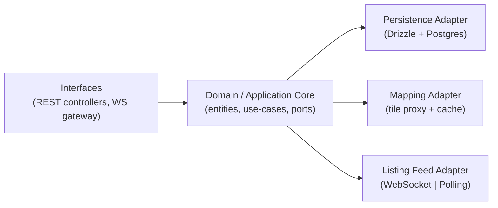
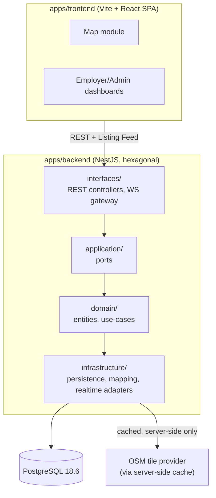
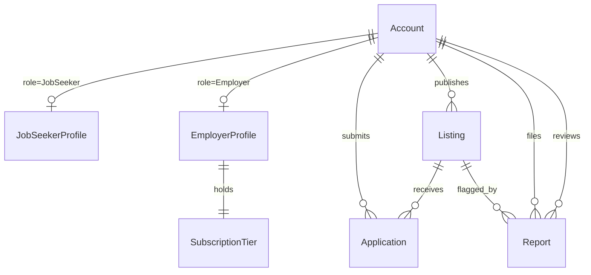

# Architecture Spine — GéoEmploi

## Design Paradigm

**Hexagonal (ports & adapters).** The core (domain entities + use-cases: matching, catch/application integrity, moderation, account governance, RGPD erasure) holds no framework or infrastructure code. Everything the core needs from the outside world — persistence, map tiles, real-time delivery — is a **port** (an interface the core defines) with one or more **adapters** (the concrete implementation) behind it. Adapters may depend on the core; the core never depends on an adapter.



## Invariants & Rules

### AD-1 — Hexagonal core, adapter-swappable persistence and mapping `[ADOPTED]`

- **Binds:** all
- **Prevents:** a DB or map-provider change turning into a backend rewrite; framework/infra concerns leaking into domain logic
- **Rule:** domain entities and use-cases live in `domain/` and `application/` (ports only) with zero imports from `infrastructure/` or any framework package. Every concrete DB or map-provider integration lives behind a port in `infrastructure/`, swappable without touching `domain/`.

### AD-2 — Sovereignty boundary on every adapter

- **Binds:** all `infrastructure/` adapters
- **Prevents:** a dependency on a paid or proprietary-account third-party service reaching the shipped product (managed DB, managed object storage, commercial map/auth/email API, AWS/GCP/Azure)
- **Rule:** no adapter may require an external account to run. `docker compose up` from a fresh clone, using only the repo's own instructions, is the only bar an adapter has to clear.

### AD-3 — Frontend is a pure SPA client

- **Binds:** `apps/frontend`
- **Prevents:** SSR/hydration complexity, a BFF layer, or the frontend bundle acquiring a map-provider API key
- **Rule:** Vite + React, client-side rendered only, talks to the backend exclusively over the documented REST API (plus the Listing Feed port for live updates). The frontend never calls the tile provider directly — every tile request goes through the backend's Mapping adapter.

### AD-4 — JWT auth, self-issued

- **Binds:** all authenticated FRs (FR-3, FR-6, FR-9 onward)
- **Prevents:** a dependency on a third-party auth provider (violates AD-2); a server-side session store adding stateful infra for no benefit
- **Rule:** the backend issues and verifies its own JWTs. Bearer token in the `Authorization` header. No session store. JWT `sub` claim is `accounts.id` (AD-14) — never a role-specific profile id.

### AD-5 — Listing Feed: one port, two interchangeable adapters

- **Binds:** FR-17
- **Prevents:** WebSocket-only code that has no real fallback when the ministerial network blocks outbound WebSockets; behavioral drift between the two delivery modes; each adapter inventing its own event shape
- **Rule:** a single `ListingFeedPort` interface has a WebSocket adapter (default) and a Polling adapter, selected by an environment variable — never a code change. Both adapters emit the identical canonical shape `{ listingId: string, eventType: 'published' | 'archived' | 'lapsed' | 'removed', listing: ListingSummaryDto }` — `eventType` is exactly `Listing.status` (AD-12), no separate vocabulary; a newly created Listing fires as `published`. WebSocket delivery can additionally be disabled entirely by config. The client dedupes incoming Listings by ID regardless of active adapter.

### AD-6 — Catch/Application integrity enforced in the domain, not the edge

- **Binds:** FR-5, FR-7, FR-8
- **Prevents:** a client-trusted catch count; a race on the 9th→10th catch double-firing or skipping the Permis de Travail unlock — including across *different* Listings caught concurrently, not just duplicate catches on the same one; duplicate Applications for the same (JobSeeker, Listing) pair; a second writer touching Application rows after creation
- **Rule:** a single `ApplyToListing` use case in the domain layer is the only path that creates an Application. It runs in one transaction: take a row lock on the JobSeeker's `accounts` row (`SELECT ... FOR UPDATE`) to serialize concurrent `ApplyToListing` calls for that JobSeeker across any Listings, check-or-create under a `UNIQUE(job_seeker_id, listing_id)` DB constraint (`job_seeker_id` references `accounts.id`, AD-14), recompute the authoritative catch count from persisted Applications under that lock, evaluate badge/Permis de Travail thresholds. No controller, adapter, or client input can bypass it or supply a catch count directly. Once created, an Application row is immutable except its own `status` field (Employer triage, FR-14) — no other use case (moderation, lifecycle jobs) writes to it; a Listing's removal/archival state is read via join to `Listing.status`, never denormalized onto Application.

### AD-7 — RGPD erasure is one domain use case

- **Binds:** FR-21
- **Prevents:** personal-data deletes/anonymization scattered across repositories, drifting from the FR-21 rule (immediate credential deletion, bounded anonymization exception for an in-progress counterparty need)
- **Rule:** account deletion goes through a single `DeleteAccount` use case in the domain layer. No repository or adapter issues a raw personal-data delete or anonymize call outside it.

### AD-8 — Brand compliance is structural, not per-screen

- **Binds:** FR-25, FR-26
- **Prevents:** a component hardcoding the institutional blue, an off-brand font, or a stray "ChomageGo" string reaching a user-facing surface
- **Rule:** one design-token module carries the charter's colors/typography; every component consumes tokens, none defines its own. The displayed product name lives in exactly one i18n/strings source, referenced everywhere text is rendered.

### AD-9 — Health check never depends on the Mapping adapter

- **Binds:** `/health` (PRD §7)
- **Prevents:** a healthcheck that synchronously calls the tile provider to "check" it — which would make `/health` fail or slow down exactly when the tile provider is unresponsive, defeating its purpose
- **Rule:** `/health` reports app status, deployed version, and DB connectivity only. It never makes a network call to the Mapping adapter or any other outbound adapter. Target: responds in <200ms unconditionally.

### AD-10 — OpenAPI is generated from code, never hand-authored

- **Binds:** every REST endpoint
- **Prevents:** a hand-written OpenAPI file drifting from the actual API (the ministry's stated worst case: "documentation that lies")
- **Rule:** every DTO carries class-validator + `@nestjs/swagger` decorators; the OpenAPI 3.0 spec is generated from those decorators at build/boot time. No manually maintained OpenAPI YAML/JSON.

### AD-11 — Mapping adapter is observable

- **Binds:** the Mapping adapter (tile cache)
- **Prevents:** a tile cache nobody can verify exists ("a cache that isn't measured is an intention, not a cache" — Thomas Vignal)
- **Rule:** the Mapping adapter exposes cache hit/miss counters, incremented on every tile request, queryable for a second-load-of-the-same-view measurement.

### AD-12 — Listing removal is always soft-delete, one shared status enum

- **Binds:** FR-18, FR-19, FR-24
- **Prevents:** a moderation action or a lapse-triggered removal that cascades away Application history or breaks the audit trail; two independently-invented status vocabularies for the same column
- **Rule:** `Listing.status` is one shared enum — `published | archived | lapsed | removed` — used by every path that changes it: moderation (FR-18/19) sets `removed`; the lifecycle job (FR-12/FR-24) sets `archived`/`lapsed`. No path hard-deletes a Listing or its related Applications, regardless of which FR triggered the change.

### AD-13 — Every account is provisioned through one path

- **Binds:** FR-20 (no admin backdoor)
- **Prevents:** a seed script, migration, or config flag quietly creating a pre-elevated account outside the governed workflow; a bolt-on verification step that can drift from the provisioning guarantee
- **Rule:** every account, including Administrator accounts, is created through the same registration/governance use case (`accounts` table, AD-14) — regardless of what triggers it. No code path may insert an account row directly. Employer activity verification (FR-10) is a step *inside* that same use case, not a second path. **Bootstrap exception:** the very first Administrator account is created by a one-time CLI/seed script that calls this same use case function directly (not via HTTP) at deploy time — it isn't a second path, and it doesn't need AD-15's guard because it never goes through `interfaces/`. Every Administrator after the first is created by an existing Administrator through the normal route, gated by AD-15.

### AD-14 — One identity table, role-specific profiles alongside it

- **Binds:** FR-3, FR-9, FR-10, FR-20, AD-4, AD-6, AD-13
- **Prevents:** two independently-built units choosing incompatible identity models (a 3-table split vs. a unified table) with no FK path between them
- **Rule:** one `accounts` table (`id`, `email`, `password_hash`, `role` — JobSeeker | Employer | Administrator) is the single identity record every other table and the JWT (AD-4) key off. Role-specific data lives in `job_seeker_profiles` and `employer_profiles`, each FK'd to `accounts.id`; Administrator carries no separate profile table. `ApplyToListing`'s `job_seeker_id` (AD-6) is `accounts.id`.

### AD-15 — Authorization is a guard at the interface layer, not an inline check

- **Binds:** every Administrator-only and Employer-only route (FR-10–FR-16, FR-19–FR-22)
- **Prevents:** five people building the moderation, governance, employer-dashboard, and metrics surfaces in parallel each enforcing role checks at a different layer with different completeness (incomplete mediation)
- **Rule:** every Administrator/Employer-only route is gated by a `RolesGuard` at the `interfaces/` layer, driven by a `@Roles()` decorator. No use case trusts a role claim that hasn't passed through this guard.

## Consistency Conventions

| Concern | Convention |
| --- | --- |
| Naming (entities, files, interfaces, events) | Domain entities use Glossary terms verbatim where they name a concept (Listing, Application, SubscriptionTier, Report, Badge). Identity is `Account` + `role` (AD-14) — "JobSeeker"/"Employer"/"Administrator" are role values and directory/module names, not separate tables (`job_seeker_profiles`, `employer_profiles` hold role-specific data). DB tables: snake_case plural. Entity IDs: UUIDv4. DTOs: `PascalCase` + `Dto`. Domain events: `PascalCase` + `Event`. Files: kebab-case. |
| Data & formats (ids, dates, error shapes, envelopes) | Dates: ISO 8601 UTC. Errors: NestJS standard exception-filter shape (`statusCode`, `message`, `error`, `timestamp`, `path`). Money (SubscriptionTier pricing): integer cents, never floats. |
| State & cross-cutting (mutation, errors, logging, config, auth) | All persistence mutation goes through the domain/service layer — controllers and adapters never call a repository directly. Config: env vars, validated at process boot (fail fast on a missing required var; must match `.env.example`). Logging: structured JSON; every Catch/Application-creation event logs job-seeker id, listing id, timestamp (AD-6, audit trail). |
| Time-bound lifecycle transitions | Listing auto-archival (30 days, FR-12) and post-lapse removal (7 days, FR-24) run via a scheduled job that mutates state at a determinate point (`Listing.status`, AD-12) — never computed at query-time by filtering "is this still valid" on read. |
| "Active" definitions (metrics) | FR-22's national metrics reuse `Listing.status = 'published'` and `accounts` activation flags exactly as AD-12/AD-13 define them — no separate "active" definition is invented for the dashboard. |
| Backend module system & toolchain | `apps/backend` runs NestJS 12 in ESM mode, with Vitest + oxlint (the CLI's ESM-track default) rather than CJS/Jest/ESLint. `[ASSUMPTION — pick before first `nest new`, either is compatible with every AD here]` |
| Enforcing structural rules | AD-1's import boundary (`domain/`/`application/` never import `infrastructure/`) is enforced by an ESLint/oxlint import-restriction rule, not review alone. AD-8 (design tokens) and AD-10 (Swagger decorators on every DTO) are checked in PR review — no automated gate for those two in v1. |

## Stack

| Name | Version |
| --- | --- |
| React | 19.2.8 |
| Vite | 8.2.2 |
| TypeScript | 6.0.3 — deliberately not 7.0.2; see Deferred |
| Tailwind CSS | 4.3.3 |
| shadcn/ui | CLI-copied components, no pinned version |
| NestJS | 12.0.1 |
| class-validator / class-transformer | latest matching NestJS 12 peer range |
| Drizzle ORM | 0.45.2 (latest pre-1.0 stable — the 1.0 line is at release-candidate (rc.4), not GA; do not adopt it yet) |
| PostgreSQL | 18.6, self-hosted via Docker Compose |
| WebSocket adapter | `@nestjs/websockets` + `ws` `[ASSUMPTION: socket.io is a drop-in swap behind AD-5's port, no spine change needed]` |

## Structural Seed





**Deployment & environments:** single environment for this engagement — fully local via Docker Compose (PostgreSQL 18.6 container + NestJS backend + Vite frontend). No cloud, staging, or production environment is provisioned; the PRD's one-page deployment note (`prd.md` §8) separately describes the hypothetical production shape for the ministry, and is not something this spine builds.

```text
apps/
  frontend/            # Vite + React SPA
    src/
      map/              # public map, catch interaction
      seeker/            # job seeker profile, applications, badges
      employer/          # employer account, publish, dashboard
      admin/              # moderation, governance, national metrics
      shared/tokens/       # design tokens (AD-8)
  backend/              # NestJS, hexagonal
    src/
      domain/             # entities + use-cases (AD-1) — ApplyToListing, DeleteAccount, ModerateListing, ...
      application/         # ports — PersistencePort, MappingPort, ListingFeedPort
      infrastructure/       # adapters — drizzle-persistence/, mapping-cache/, realtime-ws/, realtime-polling/
      interfaces/            # REST controllers, WS gateway, DTOs
        health/               # /health — DB connectivity only, never calls Mapping adapter (AD-9)
```

## Capability → Architecture Map

| Capability / Area | Lives in | Governed by |
| --- | --- | --- |
| 4.1–4.3 Map discovery, profile, gamified catch (FR-1–FR-9, FR-23) | `frontend/map`, `frontend/seeker` + backend `domain` Listing/Application use-cases | AD-1, AD-6, AD-14 |
| 4.4–4.7 Employer account, publication, application mgmt, dashboard (FR-10–FR-16) | `frontend/employer` + backend Employer/Listing services | AD-1, AD-3, AD-14, AD-15 |
| 4.8 Live map updates (FR-17) | Listing Feed port + WS/Polling adapters | AD-5 |
| 4.9 Moderation & Reporting (FR-18, FR-19) | `frontend/admin` + backend `domain` ModerateListing use-case | AD-12, AD-15 |
| 4.10 Account Governance (FR-20, FR-21) | backend `domain` DeleteAccount/registration use-cases | AD-13, AD-14, AD-15, AD-7 (FR-21 specifically) |
| 4.11 National Metrics Dashboard (FR-22) | backend read-model/aggregation query | AD-15 (access control only); reuses AD-12/AD-13's status definitions, no new invariant |
| FR-24 Subscription lapse → removal | scheduled job (see Consistency Conventions) | AD-12 (shared status enum) + Time-bound lifecycle convention |
| 4.12 Brand & naming compliance (FR-25, FR-26) | `frontend/shared/tokens`, i18n strings source | AD-8 |
| Mapping & sovereignty (`prd.md` §7–8) | backend `infrastructure/mapping-cache` | AD-2, AD-3, AD-11 |
| Health & Observability (`/health`, tile cache metrics) | backend `interfaces/health` | AD-9, AD-11 |

## Deferred

- **Redis-backed tile cache** — the in-process LRU/filesystem cache (an `[ASSUMPTION]`) is the v1 choice; swap in only if the load test (`prd.md` §7) shows it's insufficient. No AD change needed, same Mapping port.
- **socket.io swap-in** — AD-5's port contract makes this a drop-in change if `ws` proves limiting.
- **TypeScript 7 migration** — revisit once the NestJS CLI supports it; as of authoring, `nest build`/`nest start` fail outright on TypeScript 7.0.2 because its Compiler API isn't exported yet. This is a concrete toolchain blocker, not a vague ecosystem-maturity concern.
- **Production-scale capacity topology** — genuinely unspecified by the ministry beyond the 50-user demo-scale load test (`prd.md` Open Question 4); this spine covers local single-node only.
- **Full 47-page graphic charter** — AD-8 covers the three rules known today (`prd.md` Open Question 6); revisit the token module when the full document arrives.
- **Employer verification exact mechanism** — an implementation detail within FR-10's existing PRD-level assumption, not an architectural boundary.
- **Multi-node/scaling topology** — single-node Docker Compose only for v1. The PRD's "must support gradual scaling" NFR (`prd.md` §7) is a code-level concern (no in-memory state that can't be externalized later) at this altitude, not a deployment decision made here.
- **Transactional email** — no FR currently triggers an email send (notifications are in-app per FR-13); the PRD's FR-26 lists "transactional emails" among the charter-compliance surfaces to check, which is presently hypothetical. If a real trigger appears later (e.g. password reset), it must go through a self-hosted SMTP relay — the same sovereignty rule as AD-2, no commercial ESP.
